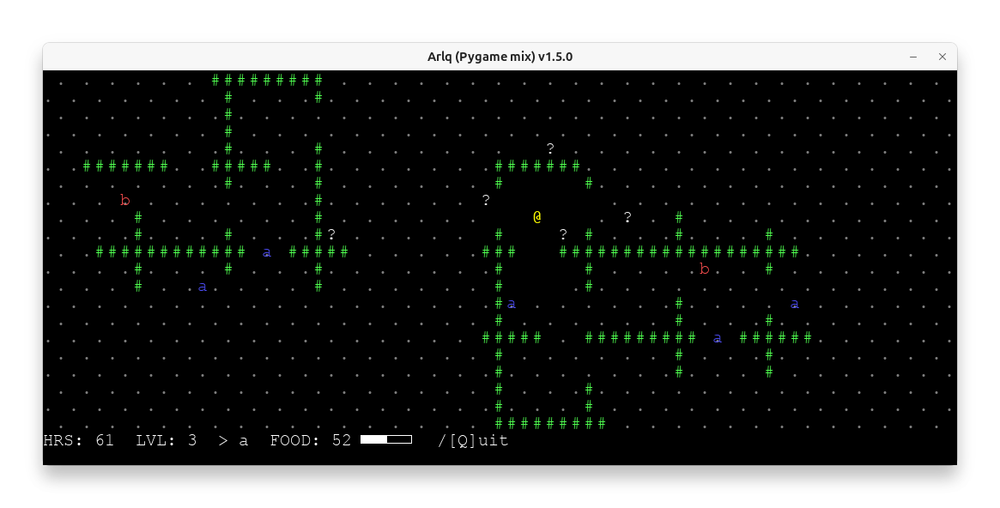

# ARLQ, another rogue-like quest game

ARLQ (Another Rogue-Like Quest) は、人間と ChatGPT が共同でコードとマニュアルを作成した実験的なローグライクゲームです。

* コードは、ゲームのおおまかな内容の記述をもとに ChatGPT で生成し、その後人間が細部を調整・改善しました。  
  * ChatGPT は、コード生成以外にも迷路生成アルゴリズムの作成や curses ライブラリの使い方の解説も担当しました。  
  * タイプヒントやコメントも ChatGPT によって生成されています。  
  * 新しいモンスターのアイデアにも ChatGPT が協力しています。  
* マニュアルは、人間がドラフトを作成し、後に ChatGPT と共に加筆・校正を行いました。



## インストール方法

以下のコマンドを実行してください:

```bash
pipx install git+https://github.com/tos-kamiya/arlq
```

インストールが完了すると、`arlq` コマンドが利用可能になります。

- オプション無しの場合は、Pygame のウィンドウでゲームが実行されます。  
- ゲームをより簡単にするには、`-T` オプション（視界が広がる）を使用します。  
- ゲームをより難しくするには、`-F` オプション（フィールドが大きくなる）または `-t` オプション（視界が狭くなる）を使用します。  
- `--curses` オプションを付けると、ターミナル上で curses を使用してゲームが実行されます。

`--curses` オプションを利用する場合は、別途 `curses` パッケージのインストールが必要です。

Ubuntu 24.04 の場合:

```bash
sudo apt install python3-curses
```

Windows の場合:

```bash
pip install windows-curses
```

## ゲームの説明

* **ゲームの目的**  
  毎回異なる通路を持つダンジョンを探索し、ドラゴンが隠した宝箱を見つけることが目的です。

* **プレイヤー**  
  プレイヤーは「@」のキャラクターを操作し、矢印キーで上下左右に移動します。

* **フォグシステム**  
  プレイヤーが歩いた場所のみが見えるフォグシステムを採用しており、オートマッピングと連動して、一度訪れたエリアは常に表示されます。

* **モンスターと同行者**  
  ダンジョン内には様々なモンスターと同行者が存在します。モンスターや同行者は最初は `?` と表示されます。接触したものについては種類（例: `a`, `b`, `c` など）が明らかになり、同じ種類はその文字で表示されます。

* **接触**  
  - **モンスター:**  
    プレイヤーがモンスターに接触すると戦闘が開始されます。  
    自分のレベル以下のモンスターなら倒してレベルアップし、持ち物を獲得できますが、より高いレベルのモンスターに敗れると、ダンジョン内のランダムな場所に再出現します。  
  - **同行者:**  
    プレイヤーが同行者に接触すると、同行者が付いてきて固有の能力でサポートします。  
    しばらくすると同行者はプレイヤーの元を離れます。  

  ※ モンスターや同行者は自ら動くことはなく、プレイヤーが近づくのを待っています。接触するか通り過ぎるかはプレイヤーの判断次第です。

* **レアタイプ**  
  一部のモンスターには、通常のものとは異なる特別な特徴を持つレアタイプが存在します。  
  例:  
  - `A`（レアアメーバ）：倒すと大幅にレベルアップします。  
  - `B`（レアバイソン）：通常のバイソンよりも多くの食料が得られます。

* **LPシステム**  
  プレイヤーはLP（ライフポイント）を持っていて、移動するたびに減少します。  
  LPがゼロになると飢えでゲームオーバーになります。モンスターを倒すと食料を補給してLPを回復できます。

* **ゲームエンド**  
  宝箱（`T`）に接触するとゲームクリアとなります。ドラゴンが守る宝箱を手に入れることが目標です。

## モンスター一覧

**ステージ1**

| 表示・名前           | 説明                                                                                                                |
| -------------------- | ------------------------------------------------------------------------------------------------------------------- |
| **a** アメーバ       | 初めから倒せるほど弱く、レベルアップに有効。                                                                        |
| **A** レアアメーバ   | 倒すと大幅にレベルが上がる珍しいアメーバ。                                                                          |
| **b** バイソン       | 2番目に弱い。倒すとたくさんの食料が得られるので、お腹がすいたときに狩るのに適しています。                           |
| **B** レアバイソン   | 通常のバイソンよりもおいしく、より多くの食料を提供します。                                                          |
| **c** キメラ         | そこそこ強く、剣を持っており、倒すと剣を取得できます。剣を所持すると次の戦闘で戦闘力が2倍になり、壁も破壊可能です。 |
| **C** レアキメラ     | 通常のキメラよりも強力で、戦闘力が3倍になる剣を持っています。                                                       |
| **d** コモドドラゴン | 強力なモンスター。倒すと多くの食料が得られますが、毒により次の戦闘で戦闘力が1/3に低下します。                       |
| **D** ドラゴン       | 非常に強く、倒すと宝箱の封印が解除されます。                                                                        |

**ステージ2**

ステージ1のモンスターに加えて、次が登場します。

| 表示・名前         | 説明                                                  |
| ------------------ | ----------------------------------------------------- |
| **e** エレボス     | 戦闘すると生命力が吸い取られてしまいます。            |
| **E** エルドリッチ | 倒すには強すぎます。                                  |
| **X** まきびし植物 | 接触すると、周りにまきびし(`x`)が撒かれてしまいます。 |

## 同行者一覧

| 表示・名前       | 説明                                                                         |
| ---------------- | ---------------------------------------------------------------------------- |
| **n** ノミコン   | プレイヤーがモンスターの隣に来ると、そのモンスターの種類を判別してくれます。 |
| **o** オキュラー | 視界を少し広げる効果があります。                                             |
| **p** ペガサス   | プレイヤーが壁に衝突しそうになると、乗り越えられるようにします。             |

## ライセンス

本プロジェクトは BSD-2 ライセンスのもとで公開されています。
