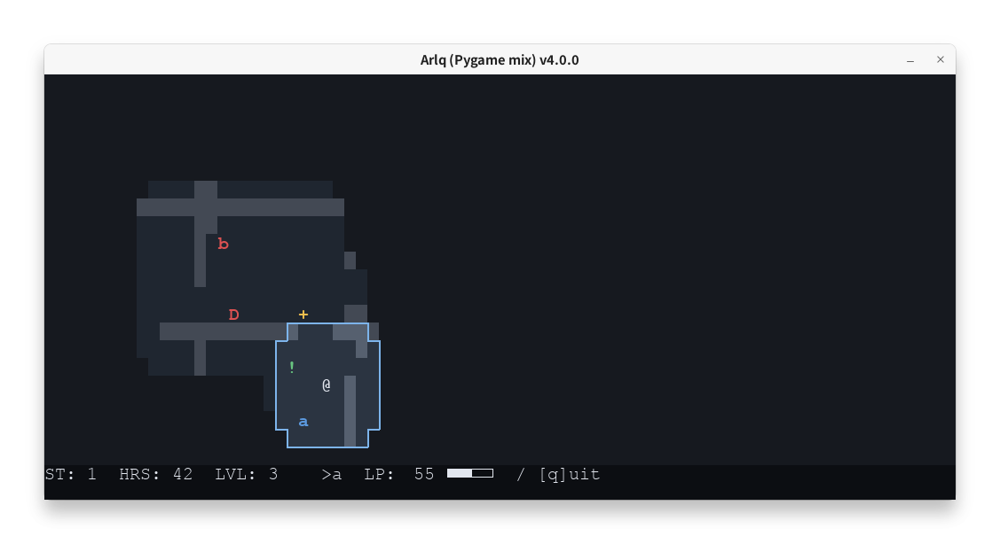

# ARLQ, another rogue-like quest game

ARLQ (Another Rogue-Like Quest) is an experimental rogue-like game created
through collaboration between humans and AIs. This repository contains
the Python implementation with Pyglet and Blessed terminal frontends.

<p align="center">
  <a href="https://pypi.org/project/arlq/">
    
  </a>
  <a href="https://www.python.org/">
    
  </a>
</p>



## Installation Instructions

ARLQ requires Python 3.10 or later. Install the latest released version with:

```bash
pipx install arlq
```

To install the latest development version directly from GitHub instead, use:

```bash
pipx install git+https://github.com/tos-kamiya/arlq
```

The required Pyglet and Blessed dependencies are installed automatically.
Once installed, the `arlq` and `arlq-cli` commands become available.

```bash
arlq
arlq-cli
```

Running `arlq` without options opens the graphical interface. Running
`arlq-cli` without options starts the terminal interface.

The terminal interface requires a terminal at least 80 columns wide and 24
lines high. If the terminal is resized below that size, the game pauses until
it is enlarged again.

Use `arlq-cli --dots` or `arlq --terminal --dots` to show unexplored areas
with dots instead of background colors. `--dots` affects the terminal
interface only; it has no effect when `arlq` starts the graphical interface.

### Options shared by `arlq-cli` and `arlq`

| Option | Description |
| --- | --- |
| `--version` | Show the version. |
| `--rematch` | Replay the most recently started stage with the same seed. |
| `--seed VALUE` | Select an integer seed or a versioned seed string. |
| `--stage 1`, `--stage 2`, `--stage 3` | Select a stage directly. |
| `--lang en`, `--lang ja`, `--lang auto` | Choose the language of in-game messages and the stage-select screen. `auto` detects it from the locale. Status-bar labels and item names stay in English. |
| `--debug-show-entities` | Show undiscovered entities. |

At game start, the stage and seed are saved to `arlq/last-seed` under the user
cache directory. `--rematch` starts the saved stage without showing the stage
selector. It cannot be combined with `--seed`. You may also specify `--stage`
if it matches the saved stage. Keep the other layout options unchanged to
reproduce the same layout.

#### Difficulty options

| Option | Description |
| --- | --- |
| `-T` / `--large-torch` | Expand the visible area. |
| `-t` / `--small-torch` | Reduce the visible area. |
| `-n` / `--narrower-corridors` | Make corridors narrower. |

### Options available only with `arlq`

| Option | Description |
| --- | --- |
| `--terminal` | Run the game in the terminal using Blessed. |
| `--scale FACTOR` | Enlarge or reduce the Pyglet GUI (from `0.5` to `4.0`, for example `--scale 1.5`). The selected scale is saved in the per-user configuration directory and used automatically on the next GUI launch. You can also change it in the stage selection screen's `Settings`. |
| `--key-repeat-interval SECONDS` | Set the GUI movement repeat delay and interval (from `0.1` to `1.0` seconds), or use `none` to disable it. The setting is saved for later GUI starts and can also be changed in the stage selection screen's `Settings`. |

## Game Description

* **Objective**  
  The goal of the game is to explore a dungeon with procedurally generated corridors and find the treasure chest hidden by the dragon. In Stage 1, find the dragon's chest; in Stage 2, find the fire drake's chest.
  In Stages 3 and 4, the two objectives are to defeat the `W` Dread Wyrm and claim its treasure chest. You must accomplish both to clear the stage. The elves' help is useful for accomplishing these objectives.

  Stage 3 consists of multiple floors. Move between floors using the stairs down `v` and stairs up `^`. Four elves, `I`, `J`, `K`, and `H`, appear.

* **Player and Fog**  
  You control the character represented by `@` using the arrow keys or WASD.
  The game uses a fog system where only the areas you have walked on are visible. Combined with auto-mapping, areas once visited remain visible on the map.

* **Monsters and Companions**  
  Unencountered monsters are displayed as `?` and companions as `!`. Once you make contact, the type is revealed, and other entities of the same kind are shown with that character. Ordinary monsters and temporary companions do not move on their own, but the Javelin Elf follows the player, moving to the position the player was at before its last move.

  Monster identification persists across floors. Companion identification in Stage 3, however, is tracked per floor, so an unencountered companion is shown again as `!` on a new floor.

  Contacting a monster starts combat. Defeating an enemy at or below your attack power levels you up and lets you obtain its belongings and food. Losing to a stronger monster sends you back to the checkpoint. However, if you lose to the very same monster twice in a row without contacting any other monster in between, you instead escape to a random location on the map (this prevents the game from becoming unwinnable when an unbeatable monster blocks a corridor).

  `a`, `A`, `b`, `c`, and `C` do not respawn once defeated. Companions provide their unique benefit for a limited time.

  Defeating the dragon or fire drake unlocks the treasure chest, and making contact with the unlocked `T` clears the stage. A sword can break up to three walls, and being poisoned halves your attack power.

* **Rare Types and Empowered Types**  
  Some monsters have rare variants with special features that differ from the normal ones.  
  For example:  
  - `A` (Rare Amoeba): Significantly boosts your level upon defeat.  
  - `C` (Rare Chimera): Grants a cursed sword that greatly increases combat power at the cost of LP.

  Some monsters also have empowered variants, starting from Stage 2. Unlike rare types, being empowered is not a benefit to you — it's simply a stronger version of the same monster, with strength equal to its normal level × 3 + 10. Empowered monsters are displayed with an apostrophe to the right, such as `b'`, and are treated as a separate monster type for discovery.

* **LP System**
  The player has LP (Life Points) that decrease with every move.
  If LP reaches zero, the game is lost due to starvation. Defeating monsters replenishes food, thereby restoring LP.

* **Game End**  
  The game is cleared when you come into contact with the treasure chest (represented by `T`). Your objective is to obtain the treasure chest guarded by the dragon.

## Monster List

### Stage 1

| Display & Name      | Description                                                                                                                                                       |
| ------------------- | ----------------------------------------------------------------------------------------------------------------------------------------------------------------- |
| **a** Amoeba        | Weak enough to be defeated from the start. Useful for leveling up.                                                                                                |
| **A** Rare Amoeba   | A rare amoeba that significantly boosts your level upon defeat.                                                                                                   |
| **b** Bison         | The second weakest. Defeating it restores a large amount of LP. Hunt it when you're hungry.                                                                       |
| **c** Chimera       | Moderately strong. It carries a sword. Taking it raises combat power to 1.5x and lets you break up to three walls.                                               |
| **d** Komodo Dragon | Powerful but dangerous. Defeating it restores a large amount of LP, but leaves you poisoned, reducing combat power to half until replaced.        |
| **D** Dragon        | Very strong; defeating it unlocks a treasure chest.                                                                                                               |

### Stage 2

In addition to the monsters from Stage 1 except for Dragon, the following appear:

Stage 2 contains four ordinary `b` Bison and two empowered `b` Bison (see Rare Types and Empowered Types above).

| Display & Name      | Description                                                                                                             |
| ------------------- | ----------------------------------------------------------------------------------------------------------------------- |
| **C** Rare Chimera  | Wields a cursed sword. It triples combat power, lets you break up to three walls, and immediately reduces LP when equipped. |
| **e** Erebus        | Battling it drains your vitality by a small amount.                                                                     |
| **F** Fire Drake    | Extremely powerful; defeating it unseals the Fire Drake's treasure chest.                                               |
| **g** Golem         | When defeated, rocks scatter. It yields no food.                                                                        |
| **H** High Elf      | Too powerful to defeat.                                                                                               |
| **X** Caltrop Plant | Contacting it causes caltrops (`x`) to be scattered around you.                                                         |

### Stage 3

Stage 3 has three connected floors. The elves can help you defeat the Dread Wyrm and claim its treasure chest.
Stage 3 features empowered versions of `b`, `c`, and `d`: `b'`, `c'`, and `d'`.
One Golem (`g`) appears on a random floor in Stage 3 and Stage 4. When defeated, rocks scatter and turn some floor tiles into walls.

#### Monsters

| Display & Name | Description |
| -------------- | ----------- |
| **w** Wyrm | Protected by a barrier. |
| **W** Dread Wyrm | Protected by a barrier and unlocks the treasure chest when defeated. |

#### Elves

| Display & Name | Description |
| -------------- | ----------- |
| **I** Isolated Elf | Reveals information about the other elves. It is inside a sealed room, so a wall-breaking sword is needed to reach it. Any contact after the first sends you back out to a random location, so you cannot get trapped inside. |
| **J** Javelin Elf | Follows the player and increases attack power by 25%. |
| **K** Collector Elf | Exchanges the cursed sword for a permanent 1.2x attack enhancement; it cannot break walls. |
| **H** High Elf | Grants the talisman after meeting any two of `I`, `J`, and `K`. |

The High Elf (`H`) and the Collector Elf (`K`) only show a message on the first contact made while their condition is unmet; any contact after that sends you to a random location on the map.

### Stage 4 (experimental, development-only)

Stage 4 is experimental and available from the stage selection menu. Its
design and gameplay are subject to change.

For a one-floor trap test arena with Stage 1's side margins, a level 150 player who has the talisman, W, two hidden chests, Vortex, and several `b` and `d` monsters, run `uv run -p .venv/bin/python python -m arlq --trap-test`. Defeating W reveals both chests as `T`; one is a Mimic. Collapse is omitted until its behavior is implemented.
The arena seed is saved, so `uv run -p .venv/bin/python python -m arlq --trap-test --rematch` reruns the same layout without the map-mode flag. `--rematch` alone also reruns the most recently played stage.

Stage 4 has four floors with the Stage 3 layout. Each floor has at most one filled room, and one separate sealed room across the stage contains the Isolated Elf. The four elves appear across the floors, and the Dread Wyrm guards the final floor. The real chest and Mimic are placed on the final floor at the start, but both remain hidden and inactive until W is defeated. Then both appear as identical `T` chests. Adjacent floors can have a second stair pair in another room when space is available. Floor 1 keeps its current roster, floors 2 and 3 use the current floor 2 roster, and floor 4 uses the current floor 3 roster. Floor 1 has 22 amoebas and two `k` Marksmen; floors 2–4 have three `k` Marksmen each. One `e` Erebus appears on floor 1, and one each of `V` Vortex and `E` Rare Erebus appear on floors 2–4.

Floors 2 and 3 contain more empowered `b` monsters; floor 4 has more empowered `d` monsters.

While playing Stage 3 or Stage 4, hold Shift and press Up or Down to inspect an adjacent floor's explored map in GUI mode. In `arlq-cli`, hold Shift and press W or S. Unexplored areas remain hidden. The bottom-right `F:` marker shows the displayed floor. A normal movement input returns the display to the player's floor and moves as usual.

#### Monsters

| Display & Name | Description |
| -------------- | ----------- |
| **k** Marksman | Level 80. After each player move, it shoots for 5 LP damage when aligned horizontally or vertically with a clear path. Walls, barriers, stairs, caltrops, monsters, and companions block its shot. Both chests block shots after W is defeated; while hidden, they do not. Unactivated `O` and `V` traps also block shots; Vortex disappears when defeated, and Collapse becomes an open hole when triggered. Arrows do not activate traps. It does not shoot at an adjacent player. Red `-` and `|` marks show where its arrows landed; each Marksman keeps up to 20 marks, oldest first, until it is defeated. |
| **E** Rare Erebus | Level 30. When defeated, halves the player's level (rounded down, minimum 1) instead of granting the usual level increase; it restores 8 LP. It respawns after the usual interval. |

#### Traps

Unidentified traps are hidden as `?`, except that a Mimic looks exactly like a treasure chest after W is defeated. Discovery is tracked per trap, so identifying one does not reveal every trap of the same kind.

Traps do not respawn. A discovered Collapse remains in place and can be used repeatedly.

| Trap | Display before discovery | Description |
| ---- | ------------------------ | ----------- |
| **M** Mimic | Hidden, then `T` | Level 85. Placed at the start on the same floor as the real treasure. Both chests appear as `T` only after the Dread Wyrm is defeated. Contact then reveals the Mimic as `M` and starts combat. If it survives, it stays visible as `M`. Defeating it restores 16 LP and leaves a faint `M` marker; it does not respawn. |
| **O** Collapse | `?` | Entering it drops the player one floor to the same coordinates. The destination must be passable. Once triggered, that location is known and appears as `O`; the hole remains usable. It does not appear on the lowest floor. |
| **V** Vortex | `?` | Level 30. When defeated, repositions monsters, floor companions, and both chests except elves, removes all Marksmen's arrow marks, and resets explored floor cells. The Mimic moves with the monsters and keeps its discovery state. The Dread Wyrm and chests move independently. Wyrm barriers are rebuilt around the new positions and become unexplored. Known walls and stairs remain visible. Collapse locations stay fixed and are not destinations for the rearrangement. |

Collapse is a planned addition. Stage 4 is experimental and its behavior may change.

## Companion List

| Display & Name | Description                                                      |
| -------------- | ---------------------------------------------------------------- |
| **l** Loop Companion | Appears in Stages 3 and 4. Sends the world back 80 turns; monster identities remain known. |
| **n** Nomicon  | Reveals the type of every monster within the player's field of vision. |
| **o** Ocular   | Significantly extends the player's field of vision.              |
| **p** Pegasus  | Appears from Stage 2 onward. Helps the player overcome walls when a collision is imminent. |

## Development commands

```bash
uv run -p .venv/bin/python python -m compileall src
uv run -p .venv/bin/python python -c "import arlq"
uv run -p .venv/bin/python pytest
uv run -p .venv/bin/python ruff check src
```

## Acknowledgments

ChatGPT, Gemini, Claude, and Grok contributed to the design and implementation of this game. Their assistance is gratefully acknowledged.

## License

This project is licensed under the BSD-2 license.
