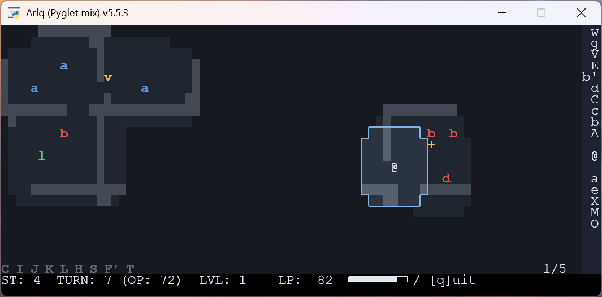

# ARLQ, another rogue-like quest game

ARLQ (Another Rogue-Like Quest) is a rogue-like game created
through collaboration between humans and AIs. This repository contains
the Python implementation with Pyglet and Blessed terminal frontends.

<p align="center">
  <a href="https://pypi.org/project/arlq/">
    
  </a>
  <a href="https://www.python.org/">
    
  </a>
</p>



## Installation Instructions

ARLQ requires Python 3.10 or later. Install the latest released version with:

```bash
pipx install arlq
```

To install the latest development version directly from GitHub instead, use:

```bash
pipx install git+https://github.com/tos-kamiya/arlq
```

The required Pyglet and Blessed dependencies are installed automatically.
Once installed, the `arlq` and `arlq-cli` commands become available.

```bash
arlq
arlq-cli
```

Running `arlq` without options opens the graphical interface. Running
`arlq-cli` without options starts the terminal interface.

The terminal interface requires a terminal at least 80 columns wide and 24
lines high. If the terminal is resized below that size, the game pauses until
it is enlarged again.

Use `arlq-cli --dots` or `arlq --terminal --dots` to show unexplored areas
with dots instead of background colors. `--dots` affects the terminal
interface only; it has no effect when `arlq` starts the graphical interface.
On light terminal themes, use `--dots` to keep unexplored areas distinct
without applying a dark background to explored areas.

### Options shared by `arlq-cli` and `arlq`

| Option | Description |
| --- | --- |
| `--version` | Show the version. |
| `--rematch` | Replay the most recently started stage with the same seed. |
| `--seed VALUE` | Select an integer seed or a versioned seed string. |
| `--stage 1`, `--stage 2`, `--stage 3`, `--stage 4` | Select a stage directly. |
| `--lang en`, `--lang ja`, `--lang auto` | Choose the language of in-game messages and the stage-select screen. `auto` detects it from the locale. Status-bar labels and item names stay in English. |
| `--debug-show-entities` | Show undiscovered entities. |

At game start, the stage and seed are saved to `arlq/last-seed` under the user
cache directory. `--rematch` starts the saved stage without showing the stage
selector. It cannot be combined with `--seed`. You may also specify `--stage`
if it matches the saved stage. Keep the other layout options unchanged to
reproduce the same layout.

#### Difficulty options

| Option | Description |
| --- | --- |
| `-T` / `--large-torch` | Expand the visible area. |
| `-t` / `--small-torch` | Reduce the visible area. |
| `-n` / `--narrower-corridors` | Make corridors narrower. |

### Options available only with `arlq`

| Option | Description |
| --- | --- |
| `--terminal` | Run the game in the terminal using Blessed. |
| `--scale FACTOR` | Enlarge or reduce the Pyglet GUI (from `0.5` to `4.0`, for example `--scale 1.5`). The selected scale is saved in the per-user configuration directory and used automatically on the next GUI launch. You can also change it in the stage selection screen's `Settings`. |
| `--key-repeat-interval SECONDS` | Set the GUI movement repeat delay and interval (from `0.1` to `1.0` seconds), or use `none` to disable it. The setting is saved for later GUI starts and can also be changed in the stage selection screen's `Settings`. |

## Game Description

* **Objective**  
  The goal of the game is to explore a dungeon with procedurally generated corridors and find the treasure chest hidden by the dragon. In Stage 1, find the dragon's chest; in Stage 2, find the fire drake's chest.
  In Stage 3, defeat the `W` Dread Wyrm and claim its treasure chest. In Stage 4, defeat the empowered Fire Drake (`F'`) and claim its treasure chest. Both objectives are required to clear either stage. The elves' help is useful for accomplishing them.

  Stage 3 consists of multiple floors. Move between floors using the stairs down `v` and stairs up `^`. Discovering a stair also marks its matching cell on the adjacent floor as explored. Four elves, `I`, `J`, `K`, and `H`, appear.

* **Player and Fog**  
  You control the character represented by `@` using the arrow keys or WASD.
  The background behind `@` turns yellow at 40 LP or below and red at 20 LP or below.
  The game uses a fog system where only the areas you have walked on are visible. Combined with auto-mapping, areas once visited remain visible on the map.
  Press `F` to toggle a highlight on every explored-map cell reachable with your remaining LP. Moving closes the preview. The estimate avoids entities shown on the map and stairs, does not break walls or count LP recovery, and includes known terrain damage and Stage 4 marksman shots when that individual is in a known area or has fired at least once. Unexplored cells remain hidden. It does not show a route.

* **Monsters, Companions, and Elves**  
  Unencountered monsters are displayed as `?`, companions as `!`, and unidentified elves as `&`. Contact reveals an entity's type.

  Monster identification persists across floors. Companion identification is tracked separately on each floor in every stage, so an unencountered companion is shown again as `!` on a new floor.

  Contacting a monster starts combat. Defeating an enemy at or below your attack power levels you up and lets you obtain its belongings and food. Losing to a stronger monster sends you back to the checkpoint. However, if you lose to the very same monster twice in a row without contacting any other monster in between, you instead escape to a random location on the map (this prevents the game from becoming unwinnable when an unbeatable monster blocks a corridor).

  Some monsters, such as `d`, respawn. Defeating a stage boss unlocks its treasure chest. Contacting the unlocked `T` clears the stage.

  Companions provide their unique benefit for a limited time. Defeating a monster consumes one unit of this duration, and each Pegasus phase jump consumes one unit as well. For example, the Nomicon identifies monsters and elves in its field of vision.

  Most elves appear from Stage 3 onward and provide support, such as increased attack power, when you meet certain conditions.

* **Rare Monster Types and Empowered Monsters**  
  Some monsters have rare variants with features that differ from normal monsters. For example, `A` (Rare Amoeba) significantly boosts your level when defeated, and `C` (Rare Chimera) grants a cursed sword that greatly increases combat power at the cost of LP. Both have special effects that benefit the player.

  Empowered variants also appear from Stage 2 onward. Unlike rare variants, they are stronger enemies, not a benefit to the player. Rank 2 has strength equal to the normal level × 3 + 10; rank 3 is three times as strong as rank 2. Rank 2 monsters are displayed with one apostrophe (`b'`) and rank 3 with a double quote (`b"`). Each rank is identified as a separate monster type.

* **LP System**
  The player has LP (Life Points) that decrease with every move.
  If LP reaches zero, the game is lost due to starvation. Defeating monsters replenishes food, thereby restoring LP.

* **Game End**  
  The game is cleared when you come into contact with the treasure chest (represented by `T`). Your objective is to obtain the treasure chest guarded by the dragon.

## Companion List

| Display & Name | Description                                                      |
| -------------- | ---------------------------------------------------------------- |
| **l** Loop Companion | Appears in Stages 3 and 4. Sends the world back 80 turns; monster identities remain known. |
| **n** Nomicon  | Reveals the type of every monster within the player's field of vision. |
| **o** Ocular   | Significantly extends the player's field of vision.              |
| **p** Pegasus  | Appears from Stage 2 onward. Helps the player overcome walls when a collision is imminent. |

## Monster List

### Stage 1

| Display & Name      | Description                                                                                                                                                       |
| ------------------- | ----------------------------------------------------------------------------------------------------------------------------------------------------------------- |
| **a** Amoeba        | Weak enough to be defeated from the start. Useful for leveling up.                                                                                                |
| **A** Rare Amoeba   | A rare amoeba that significantly boosts your level upon defeat.                                                                                                   |
| **b** Bison         | The second weakest. Defeating it restores a large amount of LP. Hunt it when you're hungry.                                                                       |
| **c** Chimera       | Moderately strong. It carries a sword. Taking it raises combat power to 1.5x and lets you break up to three walls.                                               |
| **d** Komodo Dragon | Powerful but dangerous. Defeating it restores a large amount of LP, but leaves you poisoned, reducing combat power to half until replaced.        |
| **D** Dragon        | Very strong; defeating it unlocks a treasure chest.                                                                                                               |

### Stage 2

In addition to the monsters from Stage 1 except for Dragon, the following appear:

Stage 2 also features empowered Bison (`b'`).

| Display & Name      | Description                                                                                                             |
| ------------------- | ----------------------------------------------------------------------------------------------------------------------- |
| **C** Rare Chimera  | Its Cursed Sword gives 3x attack power at the cost of vitality. |
| **e** Erebus        | Battling it drains your vitality by a small amount.                                                                     |
| **F** Fire Drake    | Extremely powerful; defeating it unseals the Fire Drake's treasure chest.                                               |
| **g** Golem         | When defeated, rocks scatter. It yields no food.                                                                        |
| **H** High Elf      | Too powerful to defeat.                                                                                               |
| **X** Caltrop Plant | Contacting it causes caltrops (`x`) to be scattered around you.                                                         |

Rare Erebus (`E`) and the Vortex (`V`) use random-floor respawns at a 65-turn
tick and can return on any Stage 4 floor. The Caltrop Plant (`X`) also
uses random-floor respawns; Stage 2, where it appears, currently has one floor.

### Stage 3

Stage 3 has three connected floors. One of the two floor transitions randomly has an extra matching pair of stairs. The elves can help you defeat the Dread Wyrm and claim its treasure chest. The elves are `I`, `J`, `K`, and `H`.
Stage 3 features empowered Bison, Chimeras, and Komodo Dragons (`b'`, `c'`, and `d'`).

The bottom-right marker shows the displayed floor as a fraction (for example, `3/4`). Elf progress and discovered floors appear at the bottom-left of the field. Contacting `I` reveals the floors of all elves. The floors where `C` was identified by the Nomicon or defeated the player are appended to `C` (for example, `C23`). Hold Shift and press Up or Down in GUI mode, or Shift and W or S in `arlq-cli`, to inspect another floor. Unexplored areas remain hidden. A normal movement input returns the display to the player's floor and moves as usual.

#### Monsters

| Display & Name | Description |
| -------------- | ----------- |
| **m** Spore | Defeating it gives you Spores and clouds your vision. |
| **w** Wyrm | Protected by a barrier. |
| **W** Dread Wyrm | Protected by a barrier and unlocks the treasure chest when defeated. |

#### Elves

| Display & Name | Description |
| -------------- | ----------- |
| **I** Isolated Elf | Reveals information about the other elves. It is in a sealed room, which you must enter by breaking a wall with a sword, flying in with Pegasus, or using stairs or a Collapse. On the second and later contacts, it sends the player to a random location on the map. |
| **J** Javelin Elf | Follows the player and increases attack power by 25%. |
| **K** Collector Elf | Exchanges the cursed sword for a permanent 1.2x attack enhancement; it cannot break walls. |
| **H** High Elf | Grants the protective amulet after meeting any two of `I`, `J`, and `K`. |

The High Elf (`H`) and the Collector Elf (`K`) only show a message on the first contact made while their condition is unmet; any contact after that sends you to a random location on the map.

### Stage 4

Like Stage 3, Stage 4 features elves, including some new ones. New monsters and traps also appear. The boss is the empowered Fire Drake (`F'`).

#### Monsters

| Display & Name | Description |
| -------------- | ----------- |
| **E** Rare Erebus | A troublesome enemy that drains your level. |
| **k** Marksman | Shoots arrows along a horizontal or vertical line, but not from an adjacent cell. Walls, stairs, companions, treasure, and active monsters block arrows; caltrops (`x`), Collapse terrain (`O`), and barriers do not. |

#### Traps

Traps are monsters with special abilities, such as disguising themselves as treasure chests or changing the field.

Unidentified traps appear as `?`. The Mimic appears with the same timing and symbol as the treasure chest.

| Display | Name | Description |
| ------- | ---- | ----------- |
| `T` | Mimic | Appears as a treasure chest after the stage boss is defeated. It has level 1; defeating it moves the player to a random position on the same floor. |
| `?` / `O` | Collapse | Displayed as `?`; stepping on it creates a pit in that cell or one of its four adjacent cells. |
| `V` | Vortex | Repositions nearby monsters, companions, and treasure chests when defeated. |

#### Elves

| Display & Name | Description |
| -------------- | ----------- |
| **L** Lifebringer Elf | Each meeting cures poison, raises your permanent LP maximum by 5, up to 120, and restores LP to 120. L then moves to a random floor. |
| **S** Sylvan Elf | Gives you fairy nectar. Companions recruited afterward, except `l`, stay with you 1.25 times longer. |

## Development commands

```bash
uv run -p .venv/bin/python python -m compileall src
uv run -p .venv/bin/python python -c "import arlq"
uv run -p .venv/bin/python pytest
uv run -p .venv/bin/python ruff check src
```

## Acknowledgments

ChatGPT, Gemini, Claude, and Grok contributed to the design and implementation of this game. Their assistance is gratefully acknowledged.

## License

This project is licensed under the BSD-2 license.
