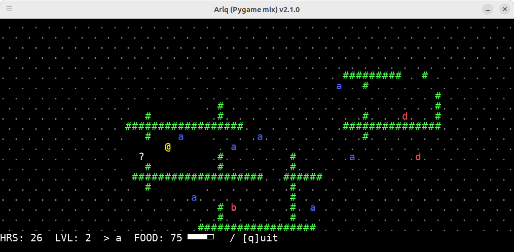

# ARLQ, another rogue-like quest game

ARLQ (Another Rogue-Like Quest) is an experimental rogue-like game created through a collaboration between humans and ChatGPT, who worked together on both the code and the manual.

* The code was generated by ChatGPT based on a rough description of the game, and humans then adjusted and improved the details.
  * ChatGPT also handled tasks beyond code generation, such as creating the maze generation algorithm and explaining how to use the curses library.
  * Type hints and comments were generated by ChatGPT.
  * ChatGPT even helped come up with ideas for new monsters.
* The manual was drafted by humans and later edited and proofread with ChatGPT.



## Installation

Run the following command:

```bash
pipx install git+https://github.com/tos-kamiya/arlq
```

Once the installation is complete, the `arlq` command will be available.

- Without any options, the game runs in a pygame window.
- With the `--curses` option, the game will run in the terminal using the curses interface.

## Game Description

* **Objective**  
  The goal of the game is to explore a dungeon with different corridors each time and find the treasure chest hidden by the dragon.

* **Player**  
  The player controls the character represented by “@” using the arrow keys to move up, down, left, and right.

* **Monsters**  
  The dungeon is filled with various monsters.  
  - For example:  
    - `a`: Amoeba. It is easy to defeat at the beginning and helps you level up.  
    - `b`: Bison. Defeating it gives you a lot of food.  
  Initially, monsters appear as “?”; when you come into contact with them, their type (such as `a`, `b`, `c`, etc.) is revealed.

* **Fog System**  
  The game uses a fog system where only the areas the player has walked on are visible. In combination with auto-mapping, once an area is visited, it remains visible.

* **Combat**  
  Combat begins when the player touches a monster.  
  - If the monster is at or below the player’s level, you can defeat it, level up, and obtain any items the monster was carrying.  
  - However, if you lose to a monster that is a higher level than you, you will respawn at a random location within the dungeon.  
  Monsters generally do not move; they wait for the player to approach. It is up to the player to decide whether to fight or bypass them.

* **Rare Types**  
  Some monsters have a rare type with special features that differ from the normal ones.  
  - For example:  
    - `A` (Rare Amoeba): Defeating it gives you a big level boost.  
    - `B` (Rare Bison): You get more food than from a regular Bison.

* **Food System**  
  Every time the player moves, their food supply decreases.  
  If your food reaches zero, you lose the game from hunger. Therefore, you need to replenish your food frequently. Defeating the Bison (`b`) provides plenty of food.

* **Game End**  
  The game is cleared when you touch the treasure chest (represented by `T`). Your goal is to obtain the treasure chest guarded by the dragon.

For more details about the monsters, please refer to the Monster List below. You might discover new things along your adventure. Enjoy exploring the dungeon!

## Monster List

| Display & Name  | Description |
|-----------------|-------------|
| a Amoeba        | Weak enough to defeat from the start. Good for leveling up. |
| b Bison         | The second weakest. Defeating it gives you plenty of food. Hunt it when you are hungry. |
| c Chimera       | Fairly strong. It carries a sword, which you can obtain upon defeating it. With the sword, your combat power triples in the next battle. |
| d Komodo Dragon | Strong. Defeating it gives you a lot of food, but you get poisoned, reducing your combat power to one-third in the next battle. |
| f Fairy         | Not an enemy. When touched, it follows you and gives you a small benefit. |
| A Rare Amoeba   | A rare amoeba that gives you a big level boost when defeated. |
| B Rare Bison    | Tastier than the regular Bison. Defeating it gives you even more food. |
| C Rare Chimera  | In addition to the sword, it grants you the ability to see far away. |
| D Dragon        | Strong. Defeating it reveals the location of the treasure chest (`T`). Even if you do not defeat it, you will be able to recognize the treasure chest. |
| E Elemental     | Not an enemy. Touching it moves you to a random location within the dungeon. It is especially helpful for high-level players. |

## License

This project is licensed under the BSD-2 license.
